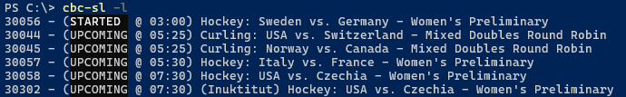

## cbc-sl, a streamlink helper for watching the Olympics on CBC.ca

I wanted to watch the Olympics on a non-NBC channel. CBC was easy to get working
in a browser with a Canadian proxy, but I wanted to use a proper media player,
so I wrote this.

This is quick and very dirty. I don't intend to expand it beyond watching the Olympics
or fix it if it breaks once I'm done watching them. (Update: Fixed for Beijing 2022.)
(Update: Fixed for Paris 2024.) (Update: Fixed for Milano Cortina 2026.)



### Guide

1. [Install streamlink][sl] and configure it. Very old versions might not work.
2. Build from source (`cargo install --git https://github.com/AlyoshaVasilieva/cbc-sl`)
   or [download a pre-built binary](https://github.com/AlyoshaVasilieva/cbc-sl/releases)
3. Run `cbc-sl --list` or `cbc-sl --replays` to see what you can watch
4. Run `cbc-sl ID` to call streamlink. (The IDs look like `30056`).

You can also use URLs, such as `cbc-sl https://gem.cbc.ca/hockey-sweden-vs-germany-womens-preliminary-30056`

Use `-p scheme://IP:port` to specify a proxy. Supports HTTP, SOCKS4, SOCKS5 proxies.

[sl]: https://streamlink.github.io/install.html

### Streamlink configuration

Streamlink must be set to handle the stream itself (via e.g. `player-continuous-http`),
*not* to allow the player to handle it (such as using `player-passthrough=http,hls`).

As an example, here's my config file on Windows:

```
player=C:\path\to\mpv.exe
player-continuous-http
ffmpeg-ffmpeg=C:\Program Files\Streamlink\ffmpeg\ffmpeg.exe
# download multiple segments at once:
stream-segment-threads=2
# reduce latency, increase chance of buffering:
hls-live-edge=2
```

### I get a weird error about invalid JSON or something else

You're probably running into the geo-blocking. CBC only allows Canadians to watch and tries to block VPNS.
If you can't watch the stream/replay on CBC.ca, it's probably this. (Note that the CBC site player might
'buffer' forever rather than saying you're blocked.)

If you *can* watch streams on the website, but *can't* with this tool, open an issue.

### Notes

* If your player fails to detect audio, look for a configuration option like
  "Stream Analysis Duration" and increase it.
* You can't seek, even in replays, unless your player has its own cache. I recommend using [mpv] to watch,
  even if you normally use a different media player.
* CBC's streams are 1080p30, 4-5mbps.

[mpv]: https://mpv.io/
